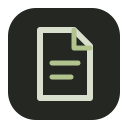
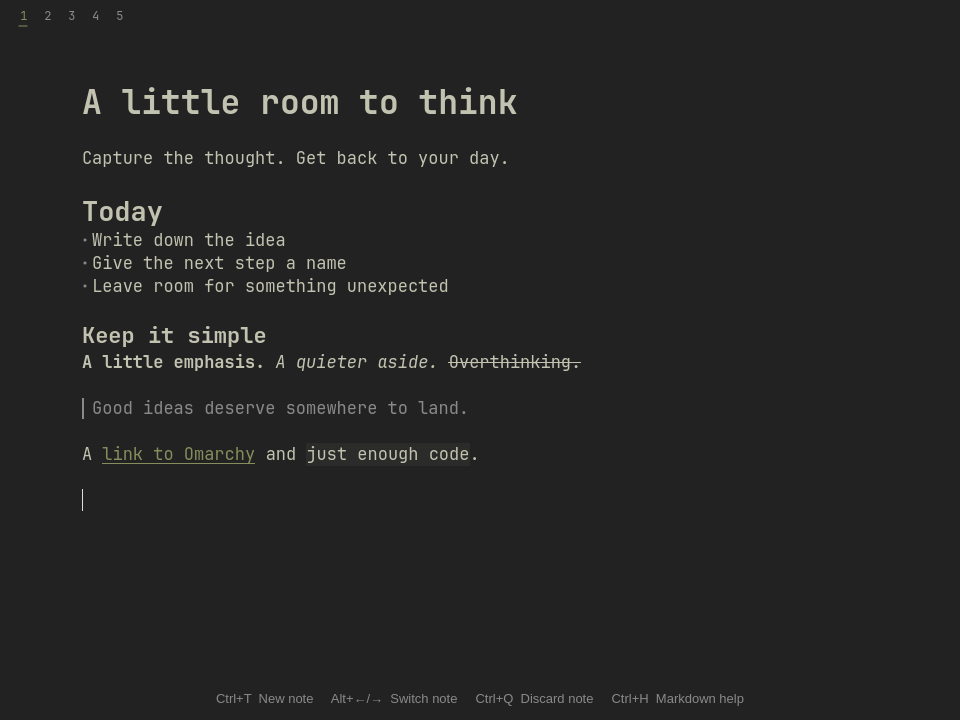
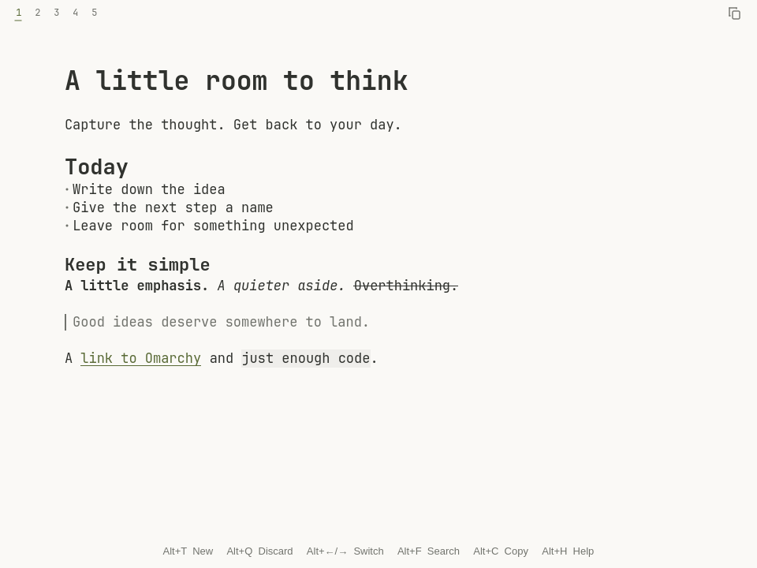
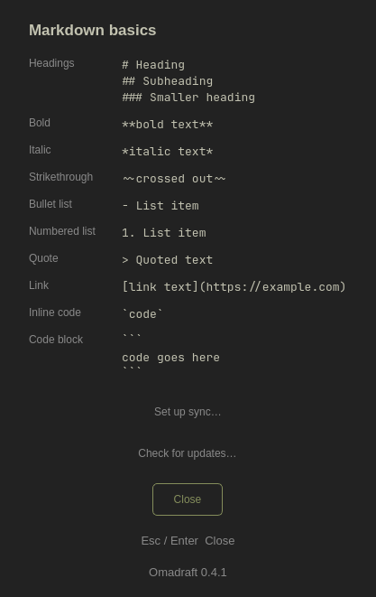

<p align="center">
  
</p>

<h1 align="center">Omadraft</h1>

<p align="center">
  A small Markdown scratchpad for Omarchy.<br>
  <strong>Open, jot, close.</strong>
</p>

<p align="center">
  <a href="https://github.com/johnohrberg/omadraft/releases/latest"></a>
  <a href="https://github.com/johnohrberg/omadraft/actions/workflows/check.yml"></a>
  <a href="LICENSE"></a>
</p>



A thought, a short list, the thing you need to remember before switching tasks.
Omadraft gives it a place to go. Start typing, close the window, and find your
words waiting next time.

Each note lives in a small numbered tab. Saving happens automatically.

## A few things, done simply

- **Write immediately.** Notes save automatically and reopen where you left off.
- **Stay on the keyboard.** Create, switch, and discard notes with a few shortcuts.
- **Write in Markdown.** Headings, emphasis, lists, quotes, and code take shape as you type.
- **Match your desktop.** Colors follow your Omarchy theme, including dialogs and keyboard hints.
- **Keep your own files.** Drafts are ordinary Markdown, stored locally. No account needed.
- **Sync when you want.** Optional Syncthing setup connects your computers without choosing a folder.
- **Update from the app.** A button in Help picks the right release for x86_64 or ARM64.

## Install on Omarchy

Run this in a terminal:

```bash
omarchy pkg add base-devel qt6-base qt6-svg qt6-wayland && \
git clone https://github.com/johnohrberg/omadraft.git && \
cd omadraft && ./bin/install
```

Then open your app launcher and type **draft**. Or run `omadraft`.

The installer builds for your computer and installs to `~/.local`. Both **x86_64**
and **ARM64** are supported. The dependency step may ask for your administrator
password; the app itself installs for your user. `~/.local/bin` must be on your `PATH`.

Already have a checkout? Run `git pull --ff-only && ./bin/install` from that folder.
To uninstall, run `./bin/uninstall`; your notes are kept.

[Release downloads](https://github.com/johnohrberg/omadraft/releases/latest) ·
[Build and packaging details](docs/development.md)

## Keyboard shortcuts

| Shortcut | Action |
| --- | --- |
| **Ctrl+T** | New note |
| **Alt+← / →** | Previous / next note |
| **Ctrl+Q** | Discard the current note, with confirmation |
| **Ctrl+H** | Markdown help, sync setup, and updates |
| **Ctrl+Z** | Undo a text edit |
| **Ctrl+Shift+Z** | Redo a text edit |
| **Esc** | Close a dialog |

Click a number to switch notes, too. In the discard dialog, use the arrow keys to
choose **Yes** or **No**, then press **Enter**. **No** is selected by default.
Closing the app keeps all your notes; discarding the last note leaves a blank one.

Accidentally deleted some text? Press **Ctrl+Z** to bring it back. Repeat to undo
earlier edits, or press **Ctrl+Shift+Z** to redo them. Each note keeps its own undo
history while the app is open. This history is not saved when you close the app
and does not restore discarded notes.

## Markdown, without the clutter

The line you are editing shows its Markdown syntax. On other lines, the markers
step out of the way: headings have distinct sizes, quotes have a subtle rule, and
emphasis looks like emphasis. Your saved text remains plain Markdown.

Need a reminder? **Ctrl+H** opens a small reference with the common syntax.
Standard editing shortcuts and undo/redo work while the app is open.

<details>
<summary><strong>See the light theme and Markdown help</strong></summary>





</details>

Omadraft supports headings, bold, italic, strikethrough, lists, blockquotes, links,
and code styling. It does not render images, tables, or embedded HTML, and it does
not fetch content from links. Undo history lasts for the current app session.

## Your desktop, your colors

Omadraft reads Omarchy's current `colors.toml` and follows theme changes while it
is open. Background, text, selections, tab numbers, dialogs, and keyboard hints
all use the palette. Muted text is adjusted for readability.

Without an Omarchy palette, it uses a built-in light or dark palette based on Qt's
preference. The screenshots above show real app windows with sample notes.

## Desktop and laptop, together

Sync is **optional**. Omadraft works completely locally without Syncthing.

To connect two computers:

1. Install Syncthing on both: `omarchy pkg add syncthing`.
2. Open **Ctrl+H → Set up sync…** in Omadraft.
3. Start Syncthing using the button if needed, then choose the other computer or
   paste its device ID.
4. Enable sharing and repeat on the other computer.

Omadraft fills in the folder details. Changes appear in open windows, and editing
continues offline. Conflicting edits are preserved as separate notes to review.
Both computers need to be online together, or share with an always-on third device.

[Full sync guide, conflict handling, and how to stop sharing →](docs/sync.md)

## Updates

Choose **Ctrl+H → Check for updates… → Update**. Omadraft verifies the download,
checks that it can run, and keeps the previous executable. Then choose
**Restart now** or reopen the app later. There are no update checks during normal startup.

Package-managed installations use the system's update flow instead.
An AUR package is **not published yet**.

[How updates work →](docs/updates.md)

## Plain files, local first

Your drafts live here:

```text
~/.local/share/omadraft/drafts/
```

`XDG_DATA_HOME` is respected. Window position and the active note stay local to each
computer. Back up the whole `~/.local/share/omadraft` directory; share only `drafts/`
with Syncthing. Delete notes through the app so their deletion can sync correctly.

[Storage, backups, and recovery →](docs/storage.md)

---

Built with **C++ and Qt 6**. Contributions and bug reports are welcome.
See [Contributing](CONTRIBUTING.md) and the [development guide](docs/development.md).

Omadraft is an independent community app for Omarchy. [MIT licensed](LICENSE).
